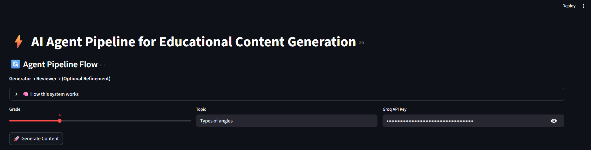
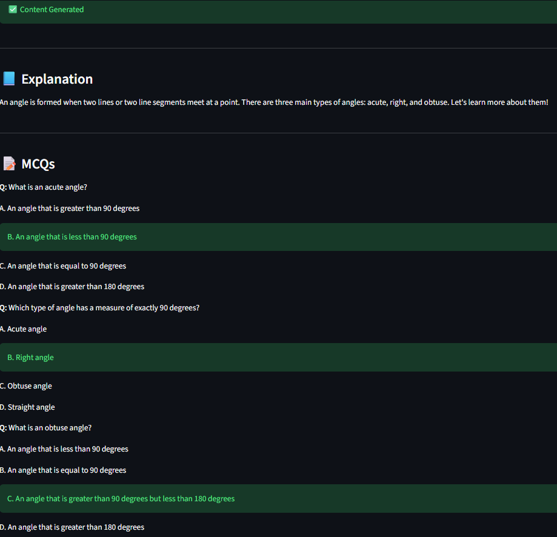
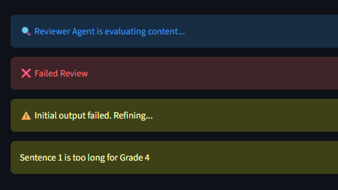
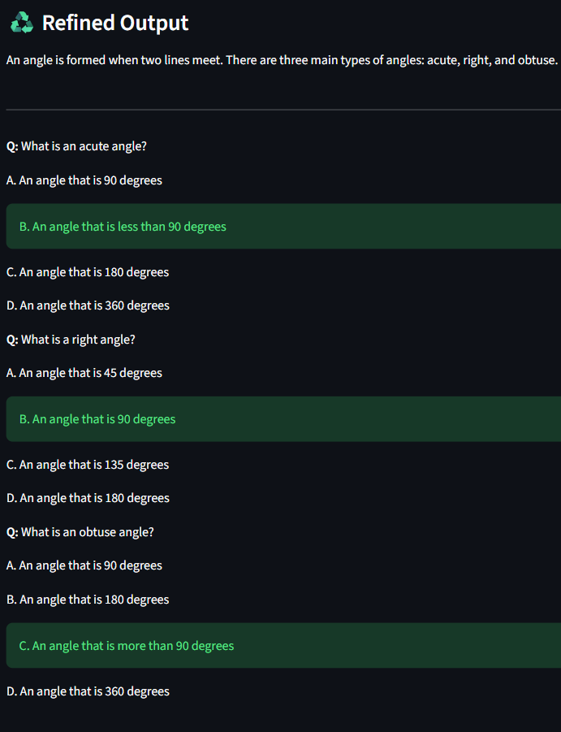
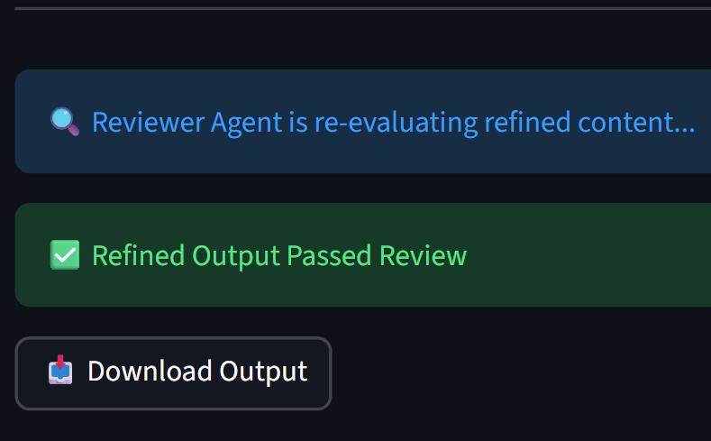

# ⚡ AI Agent Pipeline for Educational Content Generation

An agent-based AI system that generates and refines educational content using a combination of LLM-based generation and rule-based evaluation.

---

## 🚀 Overview

This project implements a **two-agent system**:

- 🧠 **Generator Agent** → Creates educational content (explanations + MCQs)
- 🔍 **Reviewer Agent** → Evaluates content for:
  - Age appropriateness
  - Clarity
  - Structural correctness

If the content fails review, the system **automatically refines it using feedback**.

---

## 🔄 Agent Pipeline Flow

Generator → Reviewer → (Fail) → Refinement → Re-Review → Pass

---

## 🧠 Key Features

- ✅ LLM-powered content generation (Groq API)
- ✅ Deterministic rule-based evaluation
- ✅ Feedback-driven refinement loop
- ✅ Structured JSON output
- ✅ Interactive UI using Streamlit
- ✅ Downloadable output

---

## 📸 Demo

### 🔹 Input Interface


---

### 🔹 Generated Output


---

### 🔹 Reviewer Feedback (Failure Case)


---

### 🔹 Refinement Step


---

### 🔹 Final Output (After Refinement)


---

## ⚙️ Tech Stack

- **Python**
- **Streamlit** (UI)
- **Groq LLM API**
- JSON-based structured outputs

---

## 📁 Project Structure

```
AI_AGENT_ASSIGNMENT/
│
├── app.py # Streamlit UI
├── generator.py # Generator Agent
├── reviewer.py # Reviewer Agent
├── pipeline.py # Agent pipeline logic
├── requirements.txt # Dependencies
├── README.md
└── screenshots/ # Demo images
```

---

## ▶️ How to Run

```bash
pip install -r requirements.txt
streamlit run app.py
```
---

## 🔐 API Key Setup

Enter your Groq API key directly in the UI when running the app.

---

## 🧠 Design Approach
- The Generator Agent uses an LLM to produce structured educational content.
- The Reviewer Agent uses deterministic rules to ensure:
- Simplicity of language
- Correct MCQ structure
- Valid answers
- If the review fails, the system performs one refinement pass using feedback-aware prompting.

---

## 💡 Future Improvements
- Add difficulty-level adaptation
- Enhance reviewer with semantic validation
- Support multi-topic batch generation

---

## 👨‍💻 Author
- **Bommala Revanth Reddy**

- **saireddybommala2005@gmail.com**

- Developed as part of an AI internship assessment.